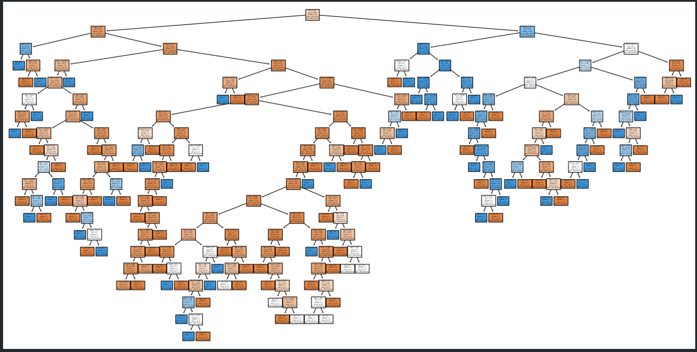
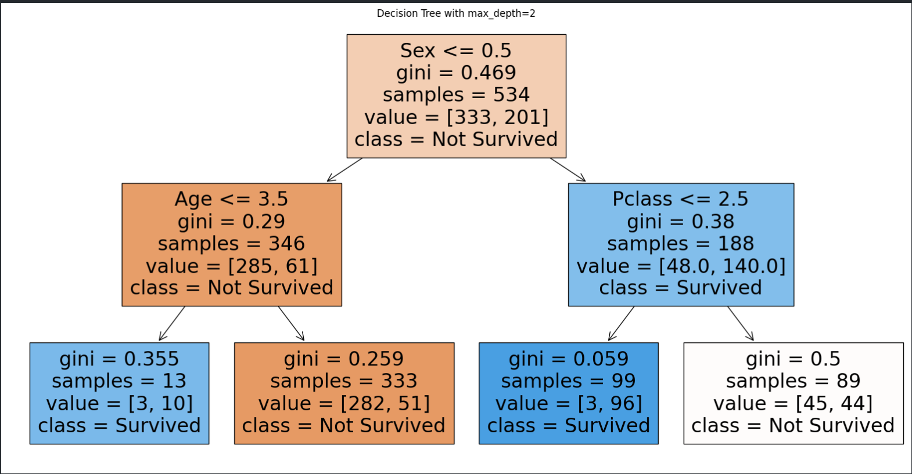
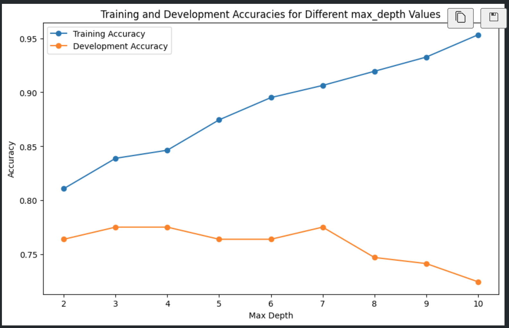

# titanic_decision_tree
I have created a decision tree that can predict the survival of passengers on the Titanic. I have not imposed any restrictions on the depth of the tree.
## Table of Contents
- [titanic\_decision\_tree](#titanic_decision_tree)
  - [Table of Contents](#table-of-contents)
  - [Installation](#installation)
  - [Usage](#usage)
  - [License](#license)
  - [Contributing](#contributing)
  - [Credits](#credits)
  - [Tests](#tests)
  - [Questions](#questions)

## Installation
Important python libraries

## Usage

A screenshot of uncontrolled tree growth is shown here:

A screenshot of the growth at maximum depth of 2 is shown here:

The accuracy of the model is evaluated here:

The repository can be accessed using this link:https://github.com/Mikemupararano/titanic_decision_tree.

## License
This application is covered under the MIT license.

## Contributing
 N/A

## Credits
N/A
## Tests
N/A

## Questions
For any questions or concerns, please contact me at [kudath@yahoo.co.uk](mailto:kudath@yahoo.co.uk).
You can also find me on GitHub: [https://github.com/Mikemupararano](https://github.com/https://github.com/Mikemupararano)
